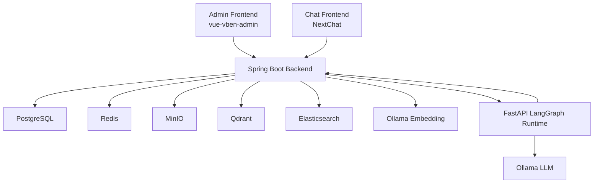
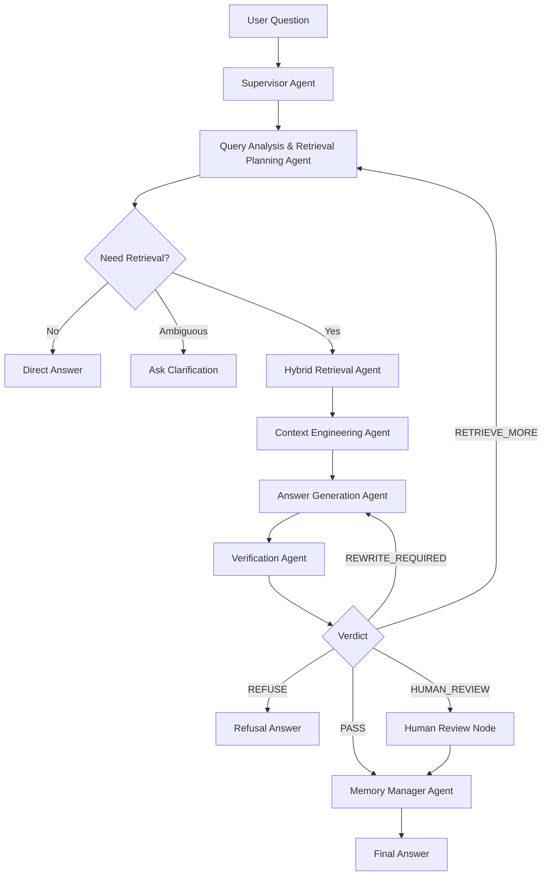
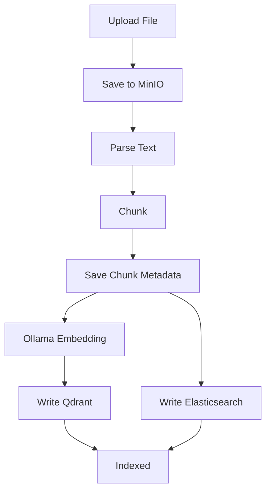

# 企业级 Multi-Agent RAG 可靠问答平台开发文档

## 1. 项目定位

本项目面向企业内部知识问答场景，目标不是实现一个普通知识库聊天框，而是构建一个基于 LangGraph 的企业级 Multi-Agent RAG 可靠问答平台。

项目主线：

- Java Spring Boot 负责企业级控制面：用户权限、知识库、文档、检索、会话、Agent Run、审计、评测。
- Python FastAPI + LangGraph 负责 Agent 执行面：多 Agent 编排、状态管理、上下文工程、答案生成、事实校验、人工介入。
- Ollama 本地部署 LLM 与 Embedding 模型，企业数据不出内网。
- 前端基于开源 Admin 与 ChatGPT-like 页面二次开发，重点展示 Agent Trace、引用证据和可靠性校验。

一句话介绍：

> 基于 Spring Boot + LangGraph 构建企业级 Multi-Agent RAG 可靠问答平台，将查询分析、检索规划、混合检索、上下文工程、答案生成、事实校验、记忆管理等步骤拆分为可观测、可恢复、可评测的 Agent 工作流。

## 2. 简历价值

项目同时服务 Java 后端开发和 Agent 开发岗位。

Java 后端能力：

- 模块化单体架构设计
- Sa-Token 登录与权限控制
- 文档上传、解析、切片、索引任务
- PostgreSQL / Redis / MinIO / Qdrant / Elasticsearch 集成
- Agent Run、Trace、审计、评测数据建模
- SSE 流式接口与服务间调用

Agent 开发能力：

- LangGraph StateGraph 状态建模
- Supervisor + Subgraph 多 Agent 编排
- Conditional Edge 条件路由
- Checkpointer 状态持久化
- Human-in-the-loop 人工介入
- Time Travel 回放与分支重跑
- 短期会话记忆与长期记忆表
- RAG 可靠性校验与评测闭环

## 3. 技术栈

后端：

- Java 17
- Spring Boot 3.x
- MyBatis Plus
- Sa-Token
- Redis
- PostgreSQL 16
- MinIO
- Qdrant
- Elasticsearch

Agent Runtime：

- Python 3.11+
- FastAPI
- LangGraph
- LangChain
- Pydantic
- Uvicorn

模型层：

- Ollama 本地 LLM
- Ollama 本地 Embedding
- 不接入外部云模型 API

推荐 Ollama 模型配置：

| 用途 | 推荐模型 | 说明 |
| --- | --- | --- |
| 主推理模型 | `qwen3:14b` | 默认用于 Answer Generation、Verification、复杂 Query Planning。适合承担主回答、事实校验和复杂推理任务。 |
| 快速推理模型 | `qwen3.5:9b` | 用于 Supervisor、简单 Query Planning、Memory Manager 等低成本节点，优先降低多 Agent 流程延迟。 |
| 嵌入模型 | `qwen3-embedding:4b` | 默认 Embedding 模型。用于文档 chunk 向量化和 query embedding，保证检索向量空间一致。 |
| 长上下文备选 | `qwen3.5:9b` | 同时作为长上下文备选模型，用于长文档总结、长上下文实验和需要更大上下文窗口的节点。 |

本机推荐配置为 RTX 4060 Ti 16GB + 32GB 内存，默认不启用 27B/30B 级模型作为主模型。大参数模型容易出现 CPU offload、延迟明显升高和多 Agent 并发不稳定问题，适合作为后续离线评测实验，不作为 MVP 默认模型。

推荐拉取命令：

```bash
ollama pull qwen3:14b
ollama pull qwen3.5:9b
ollama pull qwen3-embedding:4b
```

运行策略：

- 默认主流程使用 `qwen3:14b`。
- 简单节点和长上下文实验节点使用 `qwen3.5:9b`。
- Embedding 固定使用 `qwen3-embedding:4b`，避免更换模型导致历史向量不可比。
- MVP 阶段不建议并行跑多个 LLM 节点，避免 16GB 显存被 KV cache 和模型权重挤满。
- chunk 入库后如果更换 Embedding 模型，必须重新生成向量并重建 Qdrant collection。

前端：

- 管理后台：[vbenjs/vue-vben-admin](https://github.com/vbenjs/vue-vben-admin)
- 聊天页面：[ChatGPTNextWeb/NextChat](https://github.com/ChatGPTNextWeb/NextChat)

部署：

- Windows 11
- Docker Compose

## 4. 总体架构



架构原则：

- 前端只访问 Spring Boot。
- LangGraph Runtime 不直接暴露给前端。
- LangGraph 不绕过 Java 后端访问 Qdrant / Elasticsearch。
- 检索、权限过滤、审计、长期记忆由 Java 后端统一控制。
- LangGraph 负责编排 Agent 工作流和推理状态。

## 5. 服务边界

Spring Boot 后端负责：

- 用户、部门、角色、登录认证
- 知识库与成员权限
- 文档上传、解析、切片、索引
- Ollama Embedding 调用
- Qdrant 向量检索
- Elasticsearch BM25 检索
- 混合检索、去重、权限过滤
- Chat Session 与 Message
- Agent Run 与 Trace
- 长期记忆表
- 人工审核任务
- RAG 评测数据
- 审计日志
- SSE 事件推送

LangGraph Runtime 负责：

- Query Analysis & Retrieval Planning Agent
- Hybrid Retrieval Agent 的流程编排
- Context Engineering Agent
- Answer Generation Agent
- Verification Agent
- Memory Manager Agent
- Human Review interrupt / resume
- Checkpoint / Time Travel / Retry / Cache

## 6. Multi-Agent 工作流



核心 Agent：

1. Supervisor Agent  
   负责全局调度、异常分支、风险分支和流程控制。

2. Query Analysis & Retrieval Planning Agent  
   负责问题理解、问题类型识别、歧义判断、上下文约束提取、检索策略规划、多路 query 生成和 metadata filter 生成。

3. Hybrid Retrieval Agent  
   编排向量检索、关键词检索、元数据过滤、权限过滤、结果合并与去重。

4. Context Engineering Agent  
   负责 rerank、chunk 合并、上下文压缩、token budget 控制和 Evidence Pack 构建。

5. Answer Generation Agent  
   基于 Evidence Pack 生成带引用的草稿答案。

6. Verification Agent  
   抽取 claims，校验证据支持、引用准确性、矛盾与幻觉风险，输出 verdict。

7. Memory Manager Agent  
   读取短期会话摘要和长期记忆，判断是否生成长期记忆写入候选。

8. Human Review Node  
   不是传统 Agent，而是 LangGraph interrupt 节点，用于低置信度或高风险问题的人工审核。

## 7. LangGraph 能力落地

| LangGraph 能力 | 项目落地点 |
| --- | --- |
| StateGraph | `RagAgentState` 管理一次问答完整状态 |
| Subgraph | Query Planning、Retrieval、Verification、Memory 拆成子图 |
| Conditional Edge | 根据检索质量、校验结果、风险等级动态路由 |
| Checkpointer | PostgreSQL Checkpointer 保存图状态 |
| Short-term Memory | 基于 thread_id 保存会话级状态和摘要 |
| Long-term Memory | 使用 Java 后端长期记忆表管理 |
| Streaming | LangGraph 事件经 Spring Boot SSE 推送前端 |
| Interrupt / Command | 人工审核暂停与恢复 |
| Time Travel | 从 checkpoint 回放或 fork 新 run |
| Retry Policy | LLM、检索、rerank、verification 节点重试或降级 |
| Node Cache | Query planning、embedding、rerank、claim extraction 缓存 |
| Parallel Branch | 向量检索、关键词检索、元数据检索并行 |

## 8. Agent State 设计

```python
class RagAgentState(TypedDict):
    run_id: str
    thread_id: str
    user_id: str
    session_id: str
    kb_ids: list[str]
    question: str

    user_profile: dict
    user_permissions: dict

    query_type: str
    normalized_question: str
    need_retrieval: bool
    ambiguity_flags: list[str]
    clarification_question: str | None

    retrieval_strategy: str
    vector_queries: list[str]
    keyword_queries: list[str]
    metadata_filter: dict
    top_k: int

    retrieved_chunks: list[dict]
    reranked_chunks: list[dict]
    evidence_pack: list[dict]
    compressed_context: str

    draft_answer: str
    answer_citations: list[dict]
    claims: list[dict]
    verification_results: list[dict]

    final_answer: str
    confidence_score: float
    verdict: str
    risk_flags: list[str]

    short_term_summary: str
    long_term_memories: list[dict]
    memory_write_candidates: list[dict]

    trace_events: list[dict]
    error_info: dict
```

## 9. RAG 可靠性体系

可靠性不是一个独立 prompt，而是贯穿 LangGraph 状态机。

分层设计：

1. 权限可靠性  
   用户权限转为检索 metadata filter，并在结果合并后做二次权限校验。

2. 检索可靠性  
   使用 Qdrant 向量检索 + Elasticsearch BM25 + metadata filter + rerank。

3. 上下文可靠性  
   Context Engineering Agent 负责去重、合并、压缩、控制 token budget，构建 Evidence Pack。

4. 生成可靠性  
   Answer Agent 只能基于 Evidence Pack 回答，证据不足必须说明无法确定。

5. 引用可靠性  
   每个关键结论绑定 evidence_id，Verifier 校验 citation 是否真的支持 claim。

6. 校验可靠性  
   Verification Agent 输出 PASS、REWRITE_REQUIRED、RETRIEVE_MORE、REFUSE、HUMAN_REVIEW。

7. 评测可靠性  
   建立 RAG Evaluation 模块，统计 retrieval recall、citation accuracy、answer correctness、hallucination rate、refusal accuracy、latency。

## 10. 文档接入与解析

首期支持：

- PDF
- DOCX
- XLSX
- PPTX
- Markdown
- TXT
- HTML

二期扩展：

- CSV
- JSON
- YAML
- XML
- EML
- PNG / JPG OCR
- 代码文件

文档处理流程：



引用定位必须保留：

- 原始文件名和后缀名
- 文档版本
- 页码 / Sheet / 行列 / 幻灯片页码 / 标题路径 / 行号
- chunk_id、doc_id、kb_id

## 11. Evidence Pack

```json
{
  "evidence_id": "ev_001",
  "doc_id": "doc_123",
  "chunk_id": "chunk_456",
  "original_file_name": "员工报销制度.pdf",
  "file_ext": "pdf",
  "document_title": "员工报销制度",
  "doc_version": 1,
  "page_number": 3,
  "sheet_name": null,
  "row_start": null,
  "row_end": null,
  "slide_number": null,
  "section_title": "差旅报销",
  "heading_path": "财务制度 > 差旅报销 > 交通费",
  "content": "员工差旅报销标准为...",
  "retrieval_source": "vector+bm25",
  "retrieval_score": 0.82,
  "rerank_score": 0.91,
  "permission_checked": true
}
```

## 12. 数据库设计

PostgreSQL 作为业务权威数据源。LangGraph checkpoint 由 PostgreSQL Checkpointer 管理，Java 后端只保存 checkpoint 关联和摘要。

核心表：

- `sys_user`
- `sys_dept`
- `sys_role`
- `sys_user_role`
- `kb_space`
- `kb_member`
- `kb_document`
- `kb_document_chunk`
- `kb_document_parse_task`
- `kb_document_index_task`
- `chat_session`
- `chat_message`
- `agent_run`
- `agent_trace_event`
- `agent_checkpoint_ref`
- `long_term_memory`
- `memory_access_log`
- `human_review_task`
- `human_review_record`
- `eval_dataset`
- `eval_case`
- `eval_run`
- `eval_case_result`
- `model_config`
- `prompt_template`
- `audit_log`

`kb_document` 关键字段：

- `original_file_name`
- `display_name`
- `file_ext`
- `mime_type`
- `file_size`
- `file_hash`
- `document_title`
- `source_type`
- `source_uri`
- `version`
- `parse_status`
- `index_status`
- `permission_scope`

`kb_document_chunk` 关键字段：

- `kb_id`
- `doc_id`
- `doc_version`
- `chunk_index`
- `chunk_text`
- `token_count`
- `source_location_type`
- `page_number`
- `sheet_name`
- `row_start`
- `row_end`
- `column_start`
- `column_end`
- `slide_number`
- `section_title`
- `heading_path`
- `line_start`
- `line_end`
- `html_selector`
- `metadata_json`
- `qdrant_point_id`
- `es_doc_id`
- `content_hash`

`agent_trace_event` 关键字段：

- `run_id`
- `node_name`
- `node_type`
- `event_type`
- `status`
- `input_summary`
- `output_summary`
- `payload_json`
- `latency_ms`
- `model_name`
- `prompt_tokens`
- `completion_tokens`
- `checkpoint_id`

`long_term_memory` 关键字段：

- `owner_type`
- `owner_id`
- `memory_type`
- `content`
- `summary`
- `source_run_id`
- `source_message_id`
- `confidence_score`
- `importance_score`
- `visibility`
- `enabled`
- `expires_at`
- `metadata_json`

## 13. API 与服务交互

前端公开 API：

- `POST /api/chat/sessions`
- `POST /api/chat/sessions/{sessionId}/messages`
- `GET /api/agent/runs/{runId}/stream`
- `GET /api/agent/runs/{runId}`
- `GET /api/agent/runs/{runId}/trace`
- `POST /api/kb`
- `POST /api/kb/{kbId}/documents`
- `GET /api/documents/{docId}/chunks`
- `POST /api/review/tasks/{taskId}/approve`
- `POST /api/review/tasks/{taskId}/reject`
- `POST /api/review/tasks/{taskId}/edit`

Spring Boot 调用 LangGraph：

- `POST /agent/runs`
- `POST /agent/runs/{runId}/resume`
- `POST /agent/runs/{runId}/fork`

LangGraph 调用 Spring Boot：

- `POST /internal/retrieval/search`
- `POST /internal/memory/search`
- `POST /internal/agent/events`

SSE 事件：

- `RUN_STARTED`
- `NODE_STARTED`
- `NODE_OUTPUT`
- `TOKEN_STREAM`
- `TOOL_CALL`
- `RETRIEVAL_RESULT`
- `VERIFICATION_RESULT`
- `HUMAN_REVIEW_REQUIRED`
- `RUN_COMPLETED`
- `RUN_FAILED`

## 14. 前端设计

管理后台使用 `vbenjs/vue-vben-admin` 二次开发：

- 知识库管理
- 文档管理
- 用户权限
- 人工审核
- 长期记忆
- RAG 评测
- 系统审计
- 模型配置
- Prompt 管理

聊天页面使用 `ChatGPTNextWeb/NextChat` 二次开发：

- 会话列表
- ChatGPT-like 消息区
- SSE 流式回答
- Agent Trace 侧边栏
- 引用证据面板
- Verification 校验结果
- Human Review 状态提示

推荐聊天页面三栏布局：

```text
左侧：会话列表 + 知识库选择
中间：聊天消息区 + 输入框
右侧：Agent Trace / 引用证据 / 校验结果
```

## 15. Human-in-the-loop

触发条件：

- `confidence_score` 低于阈值
- Citation 校验失败
- 存在 hallucination flag
- 命中财务、人事、合规、合同等高风险问题
- 多次重试仍不稳定

审核动作：

- approve
- reject
- edit
- retrieve_more

LangGraph 使用 interrupt 暂停，人工审核后通过 Command resume。

## 16. 长短期记忆

短期记忆：

- 基于 LangGraph thread_id 和 checkpointer
- 保存当前会话状态、历史摘要、最近问题上下文

长期记忆：

- 放入 Java 后端 `long_term_memory` 表
- 支持用户级、部门级、组织级
- 支持禁用、删除、过期、审计

长期记忆类型：

- `PREFERENCE`
- `PROFILE`
- `TERM`
- `QA`
- `FAILURE_PATTERN`

长期记忆写入必须由 Memory Manager Agent 判断是否稳定、可复用、非敏感、可追溯。

## 17. RAG 评测

评测指标：

- `retrieval_recall`
- `retrieval_precision`
- `citation_accuracy`
- `answer_correctness`
- `faithfulness`
- `hallucination_rate`
- `refusal_accuracy`
- `latency_ms`
- `prompt_tokens`
- `completion_tokens`
- `tokens_per_second`

评测支持按知识库、问题类型、模型版本、prompt 版本进行对比。

## 18. TDD 策略

项目采用测试驱动开发。每个核心模块遵循：

```text
先写失败测试 -> 实现最小功能 -> 测试通过 -> 重构 -> 补充边界测试
```

测试分层：

1. 单元测试  
   覆盖权限判断、chunk 切分、检索结果合并、引用格式化、状态路由函数。

2. 集成测试  
   覆盖 PostgreSQL、Redis、MinIO、Qdrant、Elasticsearch、Ollama mock 或测试实例。

3. 契约测试  
   覆盖 Spring Boot 与 LangGraph Runtime 的请求响应结构。

4. Agent 图测试  
   覆盖 LangGraph 节点、router、verdict 分支、interrupt / resume。

5. RAG Golden Set 测试  
   使用固定测试文档和标准问题集，验证检索召回、引用准确率、拒答行为。

6. 端到端测试  
   覆盖上传文档、索引、提问、SSE、Trace、引用展示。

Definition of Done：

- 核心逻辑有测试
- 新增 API 有契约或集成测试
- Agent router 分支有测试
- 可靠性策略有 golden case
- 文档同步更新

## 19. 开发里程碑

MVP：

- Spring Boot 基础项目
- Docker Compose 基础设施
- 知识库与文档上传
- 文档解析、切片、Embedding、索引
- Java Retrieval API
- LangGraph 基础多 Agent 流程
- Agent Run / Trace
- Chat SSE
- 引用证据展示
- Verification Agent 基础校验

增强版：

- 知识库和文档权限
- Human-in-the-loop
- 长期记忆表与管理页面
- RAG 评测集和看板
- Prompt 版本管理

高级版：

- PostgreSQL Checkpointer 深度接入
- Time Travel
- Fork Run
- Node Cache
- Retry Policy
- Prompt A/B 对比
- Agent Trace 高级分析

## 20. 简历描述草稿

项目描述：

> 基于 Spring Boot + LangGraph 设计并实现企业级 Multi-Agent RAG 可靠问答平台，支持企业文档接入、权限隔离、本地 Ollama 模型部署、混合检索、答案溯源、执行链路审计与 RAG 评测。

技术亮点：

> 基于 LangGraph 构建多 Agent RAG 工作流，将查询分析、检索规划、上下文工程、答案生成、事实校验和记忆管理拆分为可观测节点，并通过 StateGraph、Subgraph、Checkpointer、Conditional Edge、Human-in-the-loop 和 Time Travel 实现流程编排、状态恢复和分支回放。

可靠性亮点：

> 设计 RAG 可靠性校验链路，通过 Evidence Pack、Claim Extraction、Citation Verification、低置信度拒答和人工审核机制降低幻觉率，并构建检索召回率、引用准确率、答案正确率等评测指标。
